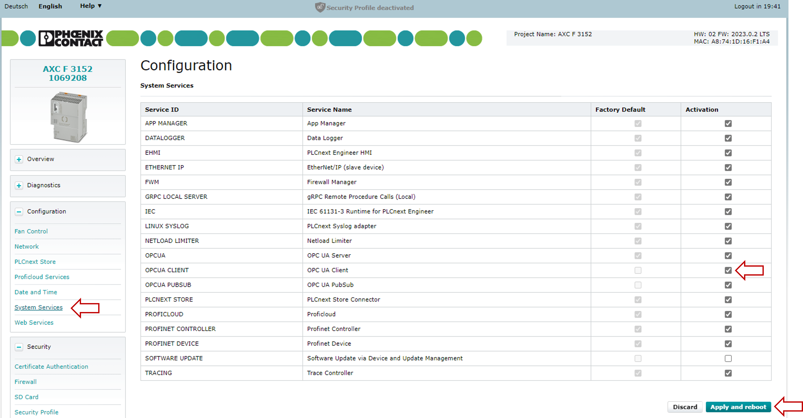

# PLCnext Technology - eUAClientConfigurator

With this tool you can generate OPC UA Client configurations for PLCnext controllers.

Content:  
[1. Quickstart](## 1. Quickstart)  
[2. Description of the client configuration file](## 2. Description of the client configuration file)  
[3. Detailed UI Description](## 3. Detailed UI Description)  
[3.1. Connections](### 3.1. Connections)  
[3.2. Client configuration](### 3.2. Client configuration)  
[4. Configuration on the file system of the controller](## 4. Configuration on the file system of the controller)  
[5. Brief description of the program code](## 5. Brief description of the program code)  

## I. Project details

|Description   | Value      |
|--------------|------------|
|Created       | 05.09.2023 |
|Last modified | 05.09.2023 |
|Controller    | AXC F 1152; AXC F 2152; AXC F 3152 |
|Firmware      | 2023.0 LTS |

## II. Background reading

- [Unified Architecture](https://opcfoundation.org/about/opc-technologies/opc-ua/)
- [OPC UA information model](https://www.plcnext.help/te/Service_Components/OPC_UA_Server/OPCUA_information_models.htm)
- [Client License in the PLCnext Store](https://www.plcnextstore.com/eu/app/1938)
- [Client Configuration in the PLCnext Infocenter](https://www.plcnext.help/te/Communication_interfaces/OPC_UA/OPC_UA_client.htm)

## III. Prerequisites for this example

- Two PLCnext Control devices with firmware 2023.0.0 or later, and at least one Axioline I/O module.
- PLCnext Engineer version 2023.0.0 or later.
- Microsoft Visual Studio 2022.
- OPC Client must be activated in the WBM of the controllers. See the following figure:

## 1. Quickstart
You need the following Hardware and Software Configuration:

- AXC F 2152/3152 with IP: 192.168.1.10 and Firmware >= 2023
- AXC F 2152/3152 with IP: 192.168.1.11 and Firmware >= 2023
- PC with PLCnext Engineer Version >= 2023.6

Use the Sample Projects in the Folder .\Simple Client Sample. In this Sample there is a AXC F 2152 (192.168.1.10) serving as OPC UA Server and a AXC F 3152 (192.168.1.11) serving as Client. Adjust the Sample Project to your controller hardware if needed. Connect to your controllers and load the sample projects into them.

Now open the eUA Client Configurator, switch to the 'Servers' tab and configure your controllers as follows:

Name: AXC F 2152  
URL: opc.tcp://192.168.1.10:4840  
User Name: <admin>  
Password: <controller passwort for admin>  
Security Mode: SignAndEncrypt  
Security Policy: Aes256_Sha256_RsaPss  

Name: AXC F 3152  
URL: opc.tcp://192.168.1.11:4840  
User Name: <admin>  
Password: <controller passwort for admin>  
Security Mode: SignAndEncrypt  
Security Policy: Aes256_Sha256_RsaPss  

The configuration should now look like in the following figure:

Now switch to the 'Groups' tab to configure the variable groups. In the drop down list 'PLCnext with eUA Client' select the AXC F 3152 (or the controller which serves as client in your configuration). Add two groups, one with group type 'subscribe from server' and the other one with group type 'write to server'. With a click on the browse button now select the following variables:

|Group     | Local Variable (Client)  | Remote Variable (Server) |
|----------|--------------------------|--------------------------|
|Subscribe | iSubscribeVar            | iSubscribedVar           |
|Write     | iWriteVar                | iWrittenVar              |

The configuration should now look like in the following figure:

Now use the export button to export the configuration in a .xml file. 

Use a tool like WinSCP to connect to the file system of the AXC F 3152 (or the controller which serves as client in your configuration). Browse to the following folder: /opt/plcnext/projects/Default/Services/OpcUA/Modules/Client/Configs/ and copy the exported .xml file to here. 

Now restart the controller through power Off/On. After startup your client configuration should work.

## 2. Description of the client configuration file

In this section the client configuration file, which can be created and exported with the eUA Client Configurator is described. The following figure shows the file exported from the simple client sample configuration mentioned in section 1 - Quickstart.

The file is seperated into the two nodes 'ServerConnections' and 'VariableGroups'. In the node <ServerConnections> you can find the informations from the 'Servers' tab of the eUA Client Configurator. In the node <VariableGroups> you can find the informations from the 'Groups' tab of the eUA Client Configurator. The client configuration file is described in detail in the [PLCnext Infocenter](https://www.plcnext.help/te/Communication_interfaces/OPC_UA/OPC_UA_client.htm).

## 3. Detailed UI Description

In this section the user interface of the eUA Client Configurator is described in detail, but not the engineering workflow. Therefere go to section 1 - Quickstart.

### 3.1. Connections

First, at least two endpoints must be created that can communicate with each other.

1.) Already added servers can be tested via the test button. The application then tries to establish a connection to the server.

2.) With the add server button more servers can be added.

1.) Name of the server.

2.) URL of the server in the format 'opc.tcp://192.168.1.10:4840'

3.) User name for the server authentication.

4.) Password for the server authentication.

5.) Security mode.

6.) Security policy (This must not be 'none' with PLCnext controller). 

7.) Cancel and discard the server configuration or apply the server configuration and add the configured server to the server list.

### 3.2. Client configuration

Now a variable group with variables can be added. For this purpose, variables of a controller that acts as a client are linked with variables of one or more servers.

1.) Project name.

2.) With a click on the new button a new variable group configuration will be created. The present variable group configuration will be discarded.

3.) With a click on the load button a present variable group configuration can be loaded into the application.

4.) With a click on the save button the variable group configuration can be saved in a file in JSON format.

5.) With a click on the export button the variable group configuration can be exported in the OPC client readable XML format.

6.) The controller which serves as OPC client must be selected here.

7.) With a click on the add group button a new variable group can be added to the configuration.

1.) Type of the variable group can be 'subscribe from server' or 'write to server'.

2.) Cycle time.

3.) Local variables at client end.

4.) Remote variables which are linked to the corresponding local variables 

5.) With a click on the add variable button a new local/remote pair of variables is added to the group.

With a click on the browse button the selection windows for local (Client) and remote variables (Server) opens.

  

Select window for local variables on client end.

  

Select window for remote variables. The server can be selected via the selection above.

## 4. Configuration on the file system of the controller

This section describes where in the file system of the controller OPC UA client configurations can be found and where the OPC UA client configuration generated with the eUA Client Configurator have to be stored. 

The file system of the PLCnext Controller can be entered using a tool like WinSCP. The following figure shows how to establish a connection to the controller.

{width=60%}  

1.) IP-Address of the PLCnext controller.

2.) Username of the PLCnext controller.

3.) Password of the PLCnext controller.

The generated client configuration has to be stored to /opt/plcnext/projects/Default/Services/OpcUA/Modules/Client/Configs/ see the following figure.

However there are some more paths which are also relevant for OPC UA client configuration, but not necessary in combination with the eUA Client Configurator.

In the following path a configuration file for the general client settings can be stored. If there is no file here and there is also no configuration in the PLCnext Engineer project on the controller, then the default settings are used:

/opt/plcnext/projects/Default/Services/OpcUA/Modules/Client/

This path contains the configuration file for the general client settings from the PLCnext Engineer project:

/opt/plcnext/projects/PCWE/Services/OpcUA/Modules/Client/

This path contains the configuration file for the client connections configuration from the PLCnext Engineer project:

/opt/plcnext/projects/PCWE/Services/OpcUA/Modules/Client/Configs/

## 5. Brief description of the program code

The solution consists of the following projects:

 - Apps/eUAClientConfigurator: The main executable as ASP.NET Core Web Application  
 - The Core folder contains some common projects, which are used by other parts of the solution  
&nbsp;&nbsp;&nbsp;&nbsp; - Arp.OpcUA.Clore: Abstraction of a minimalistic OPC UA Client  
&nbsp;&nbsp;&nbsp;&nbsp; - Arp.OpcUA.Client: Implementation of the OPC UA Client  
&nbsp;&nbsp;&nbsp;&nbsp; - Arp.OpcUA.UI.Core: Common Blazor UI components which are used for the UI projects  
 - The eUAClientConfig folder contains projects for the eUA Client configuration  
&nbsp;&nbsp;&nbsp;&nbsp; - Arp.OpcUA.ClientConfiguration: The implementation of the client configuration  
&nbsp;&nbsp;&nbsp;&nbsp; - Arp.OpcUA.UI.ClientConfiguration: A user interface for the eUA Client configuration  
 - The ServerCatalog folder contains projects for managing a list of OPC UA Servers  
&nbsp;&nbsp;&nbsp;&nbsp; - Arp.OpcUA.ServerCatalog: Collection of servers with name and access information  
&nbsp;&nbsp;&nbsp;&nbsp; - Arp.OpcUA.ServerRepository: Persistence of the server catalog as a JSON file  
&nbsp;&nbsp;&nbsp;&nbsp; - Arp.OpcUA.UI.ServerCatalog: Blazor based UI for editing the server catalog  
 
## IV. Problems?

- [Check the Output.log file](https://pxc1.esc-eu-central-1.empolisservices.com/service-express/portal/project1_p/document/iu-45-85e4a3ef-5699-4c4f-b7b9-4a04246e53d3?context=%7B%7D) on the PLC for messages from the OPC UA Client.
- Ask for help in the [PLCnext Community Forum](https://www.plcnext-community.net/en/discussions-2-offcanvas/forums.html).

If you find a mistake in this procedure, or if you would like to suggest improvements or new features, please [open an issue](https://github.com/PLCnext/eUAClientConfigurator/issues).

## V. License

Copyright (c) Phoenix Contact GmbH & Co KG. All rights reserved.

Licensed under the [MIT](/LICENSE) License.
