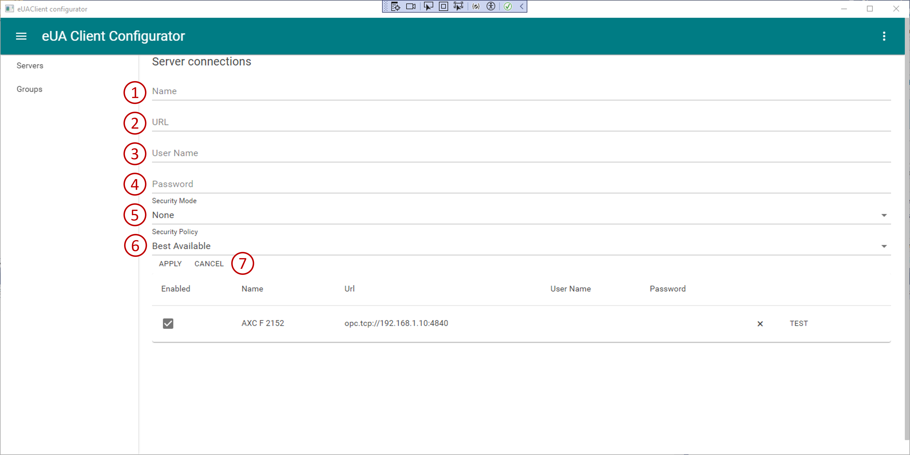
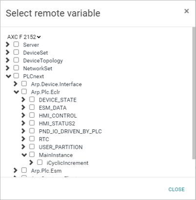

# PLCnext Technology - eUAClientConfigurator

This procedure describes the basic steps for creating an OPC UA method.

In this example, the OPC UA method will be used to call a PLCnext Engineer function block instance from an OPC UA client.

The procedure uses a custom OPC UA "Information Model", which in this case is generated using the UaModeler tool from Unified Automation. This technique can also be applied when using [standard OPC UA information models](https://opcfoundation.org/developer-tools/specifications-opc-ua-information-models) for various industries and applications.

## I. Project details

|Description   | Value      |
|--------------|------------|
|Created       | 05.09.2023 |
|Last modified | 05.09.2023 |
|Controller    | AXC F 1152; AXC F 2152; AXC F 3152 |
|Firmware      | 2023.0 LTS |

## II. Background reading

- [Unified Architecture](https://opcfoundation.org/about/opc-technologies/opc-ua/)
- [OPC UA information model](https://www.plcnext.help/te/Service_Components/OPC_UA_Server/OPCUA_information_models.htm)

## III. Prerequisites for this example

- Two PLCnext Control devices with firmware 2023.0.0 or later, and at least one Axioline I/O module.
- PLCnext Engineer version 2023.0.0 or later.
- Microsoft Visual Studio 2022

## 1. Quickstart
You need the following Hardware and Software Configuration:

- AXC F 2152/3152 with IP: 192.168.1.10 and Firmware >= 2023
- AXC F 2152/3152 with IP: 192.168.1.11 and Firmware >= 2023
- PC with PLCnext Engineer Version >= 2023.6

Use the Sample Projects in the Folder .\Simple Client Sample. In this Sample there is a AXC F 2152 (192.168.1.10) serving as OPC UA Server and a AXC F 3152 (192.168.1.11) serving as Client. Adjust the Sample Project to your controller hardware if needed. Connect to your controllers and load the sample projects into them.

Now open the eUA Client Configurator, switch to the 'Servers' tab and configure your controllers as follows:

Name: AXC F 2152  
URL: opc.tcp://192.168.1.10:4840  
User Name: <admin>  
Password: <controller passwort for admin>  
Security Mode: SignAndEncrypt  
Security Policy: Aes256_Sha256_RsaPss  

Name: AXC F 3152  
URL: opc.tcp://192.168.1.11:4840  
User Name: <admin>  
Password: <controller passwort for admin>  
Security Mode: SignAndEncrypt  
Security Policy: Aes256_Sha256_RsaPss  

The configuration should now look like in the following figure:

Now switch to the 'Groups' tab to configure the variable groups. In the drop down list 'PLCnext with eUA Client' select the AXC F 3152 (or the controller which serves as client in your configuration). Add two groups, one with group type 'subscribe from server' and the other one with group type 'write to server'. With a click on the browse button now select the following variables:

|Group     | Local Variable  | Remote Variable  |
|----------|-----------------|------------------|
|Subscribe | iSubscribeVar   | iSubscribedVar   |
|Write     | iWriteVar       | iWrittenVar      |

## 2. UI Description

### 2.1. Connections

First, at least two endpoints must be created that can communicate with each other.

1.) Already added servers can be tested via the test button. The application then tries to establish a connection to the server.

2.) With the add server button more servers can be added.

1.) Name of the server.

2.) URL of the server in the format 'opc.tcp://192.168.1.10:4840'

3.) User name for the server authentication.

4.) Password for the server authentication.

5.) Security mode.

6.) Security policy.

7.) Cancel and discard the server configuration or apply the server configuration and add the configured server to the server list.

### 2.2. Client configuration

Now a variable group with variables can be added. For this purpose, variables of a controller that acts as a client are linked with variables of one or more servers.

1.) Name of the variable group configuration.

2.) With a click on the new button a new variable group configuration will be created. The present variable group configuration will be discarded.

3.) With a click on the load button a present variable group configuration can be loaded into the application.

4.) With a click on the save button the variable group configuration can be saved in a file in JSON format.

5.) With a click on the export button the variable group configuration can be exported in the OPC client readable XML format.

6.) The controller which serves as OPC client must be selected here.

7.) With a click on the add group button a new variable group can be added to the configuration.

1.) Type of the variable group can be 'subscribe from server' or 'write to server'.

2.) Cycle time.

3.) Local variables at client end.

4.) Remote variables which are linked to the corresponding local variables 

5.) With a click on the add variable button a new local/remote pair of variables is added to the group.

Select window for local variables on client end.

Select window for remote variables. The server can be selected via the selection above.

## IV. Problems?

- [Check the Output.log file](https://pxc1.esc-eu-central-1.empolisservices.com/service-express/portal/project1_p/document/iu-45-85e4a3ef-5699-4c4f-b7b9-4a04246e53d3?context=%7B%7D) on the PLC for messages from the OPC UA server.
- Ask for help in the [PLCnext Community Forum](https://www.plcnext-community.net/en/discussions-2-offcanvas/forums.html).

If you find a mistake in this procedure, or if you would like to suggest improvements or new features, please [open an issue](https://github.com/PLCnext/OpcUaMethods/issues).

## V. License

Copyright (c) Phoenix Contact GmbH & Co KG. All rights reserved.

Licensed under the [MIT](/LICENSE) License.
